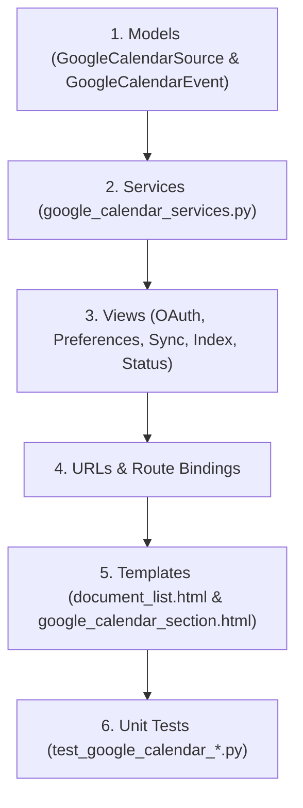

# Technical Implementation Plan: Google Calendar Integration & Sync Engine

---

## 1. Component Dependency Analysis

The feature builds vertically on top of Django models, Google Calendar API services, HTMX views, and Django templates:

---

## 2. Database Migration & Schema Design

### `GoogleCalendarSource` Model (`src/apps/documents/models.py`)
- `project`: `OneToOneField(Project, related_name='google_calendar_source', on_delete=CASCADE)`
- `source_type`: `CharField(choices=[('document', 'Document'), ('obsidian', 'Obsidian'), ('google_calendar', 'Google Calendar')])`
- `access_token`: `TextField(blank=True)`
- `refresh_token`: `TextField(blank=True)`
- `token_expiry`: `DateTimeField(null=True, blank=True)`
- `selected_calendars`: `JSONField(default=list)` (e.g., `["primary", "calendar_id_2"]`)
- `lookback_days`: `IntegerField(default=30)`
- `lookahead_days`: `IntegerField(default=365)`
- `sync_token`: `CharField(max_length=512, blank=True)`
- `sync_status`: `CharField(choices=[('IDLE', 'Idle'), ('SYNCING', 'Syncing Events'), ('INDEXING', 'Indexing Vectors'), ('COMPLETED', 'Completed'), ('FAILED', 'Failed')])`
- `total_events_count`: `IntegerField(default=0)`
- `indexed_events_count`: `IntegerField(default=0)`
- `pending_events_count`: `IntegerField(default=0)`
- `failed_events_count`: `IntegerField(default=0)`
- `error_message`: `TextField(blank=True)`

### `GoogleCalendarEvent` Model (`src/apps/documents/models.py`)
- `calendar_source`: `ForeignKey(GoogleCalendarSource, related_name='events', on_delete=CASCADE)`
- `event_id`: `CharField(max_length=255)`
- `summary`: `CharField(max_length=500)`
- `relative_path`: `CharField(max_length=1024)` (e.g. `Calendar/2026-08-05_Team_Sync.md`)
- `status`: `CharField(choices=[('PENDING', 'Pending Indexing'), ('INDEXED', 'Indexed'), ('FAILED', 'Failed')])`
- `event_start`: `DateTimeField(null=True, blank=True)`
- `event_end`: `DateTimeField(null=True, blank=True)`
- `last_synced_at`: `DateTimeField(auto_now=True)`
- `last_indexed_at`: `DateTimeField(null=True, blank=True)`
- `error_message`: `TextField(blank=True)`

---

## 3. Service Functions (`src/apps/documents/google_calendar_services.py`)

1. **`get_google_oauth_auth_url(project_id: str) -> str`**: Reads `git_ignore/client_secret_*.json` and constructs authorization URL with scopes `https://www.googleapis.com/auth/calendar.readonly`.
2. **`exchange_oauth_code_for_tokens(code: str) -> dict`**: Exchanges auth code for `access_token` and `refresh_token`.
3. **`refresh_oauth_access_token(source: GoogleCalendarSource) -> str`**: Refreshes expired access tokens.
4. **`fetch_google_user_calendars(source: GoogleCalendarSource) -> list[dict]`**: Returns user's accessible calendars (Primary + sub-calendars).
5. **`convert_event_to_markdown(event: dict) -> tuple[str, str]`**: Generates YAML frontmatter Markdown string and file path inside `rag_data/<store_id>/Calendar/`.
6. **`sync_google_calendar_events_task(source_id: int)`**: Non-blocking `threading.Thread` target that fetches event deltas/full window, writes Markdown notes, updates DB, and updates progress counters.
7. **`index_google_calendar_events_task(source_id: int)`**: Non-blocking worker that vectorizes `PENDING` notes via `gemini-embedding-001` and saves to `PGVectorStore`.

---

## 4. Views & Route Maps (`src/apps/documents/views.py` & `urls.py`)

- `google_calendar_oauth_callback(request)`: Route `/rag/google/oauth2callback/`
- `google_calendar_save_preferences(request, store_id)`: Route `/projects/<store_id>/google-calendar/preferences/`
- `google_calendar_sync(request, store_id)`: Route `/projects/<store_id>/google-calendar/sync/`
- `google_calendar_index_new(request, store_id)`: Route `/projects/<store_id>/google-calendar/index-new/`
- `google_calendar_full_reindex(request, store_id)`: Route `/projects/<store_id>/google-calendar/full-reindex/`
- `google_calendar_status(request, store_id)`: Route `/projects/<store_id>/google-calendar/status/`

---

## 5. Verification Checkpoints

1. **Phase 1 Checkpoint:** Database migration succeeds, models register in Django admin, unit tests in `test_google_calendar_models.py` pass 100%.
2. **Phase 2 Checkpoint:** Service functions correctly mock Google API responses, construct Markdown notes with frontmatter, and pass unit tests in `test_google_calendar_services.py`.
3. **Phase 3 Checkpoint:** HTMX views and templates render preferences, progress bar, action buttons, and event status table cleanly. Pass all tests in `test_google_calendar_views.py`.
4. **Phase 4 Checkpoint:** Full test suite execution (`pytest Testing/unit/documents/`) passes 100% with no regressions.
