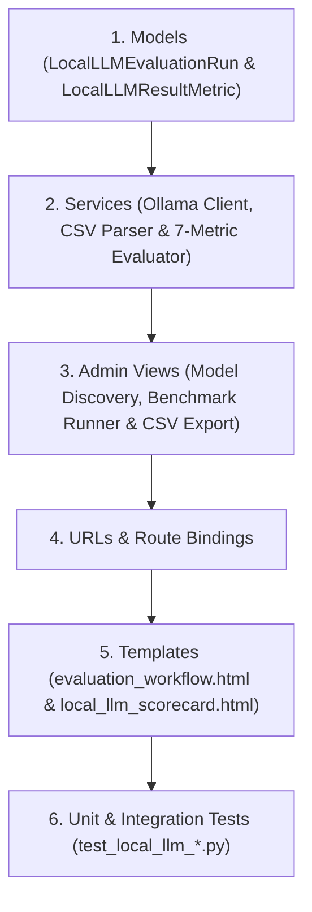

# Technical Implementation Plan: Local LLM Benchmark Evaluation Workflow

---

## 1. Component Dependency Analysis

The feature is built vertically across Django models, local Ollama integration services, Gemini evaluation judge, HTMX endpoints, and Unfold admin templates:

---

## 2. Database Migration & Schema Design

### `LocalLLMEvaluationRun` Model (`src/apps/evaluate/models.py`)
- `id`: `UUIDField(primary_key=True, default=uuid.uuid4, editable=False)`
- `project`: `ForeignKey(Project, on_delete=CASCADE, related_name="local_llm_runs")`
- `models_evaluated`: `JSONField(default=list)` (e.g. `["llama3.1:8b", "mistral:latest"]`)
- `status`: `CharField(choices=[('PENDING', 'Pending'), ('RUNNING', 'Running'), ('SUCCESS', 'Success'), ('FAILED', 'Failed')])`
- `dataset_name`: `CharField(max_length=255, default="Custom Benchmark CSV")`
- `total_questions`: `IntegerField(default=0)`
- `best_model`: `CharField(max_length=128, blank=True)`
- `best_overall_score`: `FloatField(null=True, blank=True)`
- `summary_scores`: `JSONField(default=dict)` (model-to-scores map for fast scorecard rendering)
- `started_at`: `DateTimeField(auto_now_add=True)`
- `completed_at`: `DateTimeField(null=True, blank=True)`
- `error_message`: `TextField(blank=True)`

### `LocalLLMResultMetric` Model (`src/apps/evaluate/models.py`)
- `id`: `UUIDField(primary_key=True, default=uuid.uuid4, editable=False)`
- `run`: `ForeignKey(LocalLLMEvaluationRun, on_delete=CASCADE, related_name="item_metrics")`
- `model_name`: `CharField(max_length=128)`
- `question`: `TextField()`
- `ground_truth`: `TextField()`
- `retrieved_context`: `TextField(blank=True)`
- `model_answer`: `TextField()`
- `faithfulness`: `FloatField(default=0.0)`
- `context_utilization`: `FloatField(default=0.0)`
- `citation_accuracy`: `FloatField(default=0.0)`
- `tokens_per_second`: `FloatField(default=0.0)`
- `reply_time`: `FloatField(default=0.0)`
- `instruction_following`: `FloatField(default=0.0)`
- `markdown_compatibility`: `FloatField(default=0.0)`
- `overall_score`: `FloatField(default=0.0)`
- `created_at`: `DateTimeField(auto_now_add=True)`

---

## 3. Service Functions & Algorithms (`src/apps/evaluate/eval_services.py`)

1. **`fetch_available_ollama_models() -> list[dict]`**:
   - Queries `OLLAMA_BASE_URL/api/tags` with a 3-second timeout.
   - Extracts model names, parameter sizes, and modification timestamps.
   - Returns a structured list; gracefully catches connection errors with descriptive offline status.

2. **`parse_benchmark_csv(csv_content: str | bytes) -> list[dict]`**:
   - Parses CSV string/bytes handling UTF-8 and BOM encodings.
   - Maps column aliases for question (`question`, `questions`, `query`) and answer (`answer`, `answers`, `ground_truth`, `groundtruth`).
   - Ignores extraneous columns. Returns `[{"question": ..., "ground_truth": ...}, ...]`.

3. **`retrieve_project_context_chunks(project: Project, query: str, top_k: int = 4) -> list[dict]`**:
   - Queries vector index for the project (PostgreSQL PGVector or Local Store) and returns retrieved context passages with metadata citations.

4. **`query_local_ollama_model(model_name: str, prompt: str, system_prompt: str = "") -> dict`**:
   - Calls Ollama `/api/generate` with model warmup logic.
   - Captures `response`, `total_duration`, `load_duration`, `prompt_eval_duration`, `eval_duration`, `eval_count`.
   - Computes raw metrics:
     - $\text{TPS} = \frac{\text{eval\_count}}{\text{eval\_duration} / 10^9}$
     - $\text{Reply Time} = \frac{\text{prompt\_eval\_duration} + \text{eval\_duration}}{10^9}$

5. **Metric Scoring Functions (Normalized $0.0 - 10.0$ Scale)**:
   - `score_tokens_per_second(tps: float) -> float`: Non-linear scaling mapping $0\text{ tok/s} \to 0$, $10\text{ tok/s} \to 3.5$, $20\text{ tok/s} \to 7.0$, $\ge 35\text{ tok/s} \to 10.0$.
   - `score_reply_time(seconds: float) -> float`: Mapping $<1.5\text{s} \to 10.0$, $3\text{s} \to 8.0$, $5\text{s} \to 6.0$, $>10\text{s} \to 2.0$.
   - `score_markdown_compatibility(text: str) -> float`: Deterministic validation of balanced formatting, code block fences, list syntax, tables, and `[[WikiLinks]]`.
   - `score_qualitative_metrics_with_judge(question: str, ground_truth: str, context: str, model_answer: str) -> dict`:
     - Invokes Gemini / Project Evaluator with strict system prompt requesting JSON score breakdown for `faithfulness`, `context_utilization`, `citation_accuracy`, and `instruction_following` (each clamped $0.0 - 10.0$).
   - `calculate_overall_score(scores: dict) -> float`: Exact arithmetic mean of all 7 criteria.

6. **`run_local_llm_benchmark_pipeline(project: Project, models: list[str], dataset: list[dict], run: LocalLLMEvaluationRun) -> LocalLLMEvaluationRun`**:
   - Coordinates multi-model benchmark loop, saves item metrics, aggregates summary scores, and identifies the best model.

---

## 4. Views & Route Maps (`src/apps/evaluate/admin_views.py` & `urls.py`)

- `LocalLLMModelListView`: Route `GET /rag/evaluate/local-llm/models/` (returns HTML partial for dynamic model multi-selection).
- `RunLocalLLMBenchmarkView`: Route `POST /rag/evaluate/local-llm/run/` (handles multipart CSV form upload and returns `local_llm_scorecard.html`).
- `ExportLocalLLMCSVEvaluationView`: Route `GET /rag/evaluate/local-llm/<uuid:run_id>/export-csv/` (streams 12-column CSV file download).

---

## 5. Verification Checkpoints

1. **Phase 1 Checkpoint:** Database migration succeeds, models register in Django admin, unit tests in `test_local_llm_models.py` pass 100%.
2. **Phase 2 Checkpoint:** Ollama client, CSV parser, metric scoring algorithms, and Gemini judge mock pass in `test_local_llm_eval.py`.
3. **Phase 3 Checkpoint:** HTMX views and templates render model checkboxes, CSV dropzone, loading state, comparative scorecard table, and CSV download. Pass all tests in `test_local_llm_views.py`.
4. **Phase 4 Checkpoint:** Full pytest suite passes 100% with no regressions.
