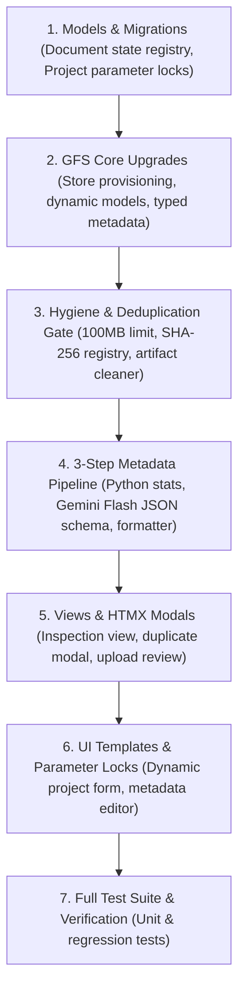

# Technical Implementation Plan: Google File Search Integration, Ingestion Hygiene & Unified Document Pipeline (Aug 3)

---

## 1. Component Dependency Analysis

The implementation is structured into a vertical dependency pipeline across models, GFS core services, document hygiene & deduplication, metadata extraction, HTMX views, and UI templates:



---

## 2. Database Schema & Migration Design

### 1. `Document` Model Updates (`src/apps/documents/models.py`)
- `content_hash`: `CharField(max_length=64, blank=True, db_index=True, help_text="SHA-256 cryptographic hash of binary")`
- `store_file_id`: `CharField(max_length=255, blank=True, help_text="Google Document Resource Name")`
- `custom_metadata`: `JSONField(default=dict, blank=True, help_text="Stored key-value metadata tags")`
- Maintain existing `indexed_at`, `state`, `document_name`, `display_name`, `error_message`.

### 2. `Project` Model Updates (`src/apps/projects/models.py`)
- Update `clean()` validation:
  - Re-enable `storage_type = 'google'` (remove the "not implemented" block).
  - When `storage_type == 'google'`:
    - Ensure `chunking` is set to `"fixed-size"` or `"default"`.
    - Ensure `llm_model` is restricted to `['gemini-2.5-flash-lite', 'gemini-3.5-flash-lite', 'gemini-3.7-flash']`.
    - Ensure `synthesizer = False` and `use_hyde = False`.
- Update choices for `llm_model` to include `gemini-3.5-flash-lite` and `gemini-3.7-flash`.

---

## 3. Service Signatures & Architecture

### 1. GFS Core Enhancements (`src/google_file_search.py`)
```python
def create_file_search_store(display_name: str) -> str:
    """Create a new File Search Store on Google Cloud and return resource name."""

def add_document_to_store(
    store_id: str, 
    file_path: str, 
    custom_metadata: list[dict] = None
) -> str:
    """Upload document to GFS store with up to 20 typed metadata entries."""

def ask_store_question(
    store_id: str, 
    query: str, 
    system_prompt: str = None, 
    model: str = "gemini-2.5-flash-lite", 
    metadata_filters: str = None
) -> str:
    """Query GFS store using selected Gemini model, system prompt, and optional metadata filter."""
```

### 2. Hygiene & Deduplication Engine (`src/apps/documents/services.py`)
```python
def compute_file_sha256(file_path: str) -> str:
    """Calculate SHA-256 hash of binary file stream."""

def check_document_hygiene(file_path: str, filename: str) -> dict:
    """Validate format whitelist, 0-byte guard, 100MB limit, and PDF/DOCX integrity."""

def strip_noisy_artifacts(text: str) -> str:
    """Strip repeated headers, footers, pagination markers (Page X of Y), and HTML noise."""
```

### 3. Metadata Extraction & Review Pipeline (`src/apps/documents/services.py`)
```python
def extract_system_and_file_metadata(file_path: str, user=None) -> list[dict]:
    """Step 1: Extract technical file attributes and PDF/DOCX embedded properties."""

def extract_ai_metadata_with_gemini_flash(sample_text: str) -> list[dict]:
    """Step 2: Sample text and call gemini-2.5-flash-lite with structured JSON schema."""

def format_and_validate_gfs_metadata(metadata_list: list[dict]) -> list[dict]:
    """Step 3: Enforce max 20 entries, strict string_value or numeric_value mutually exclusive typing."""
```

---

## 4. View Flows & HTMX Endpoints

1. **Project Creation & Immediate Provisioning (`POST /rag/projects/create/`):**
   - If `storage_type == 'google'`, calls `gfs.create_file_search_store()` immediately.
   - Persists `external_store_id` in database.
2. **Pre-Upload Inspection Endpoint (`POST /rag/documents/inspect/<store_id>/`):**
   - Receives raw file upload via HTMX.
   - Computes SHA-256 hash; if duplicate exists, renders `partials/document_duplicate_modal.html`.
   - Runs hygiene checks; if invalid, returns error toast.
   - Runs Step 1 (Python) + Step 2 (Gemini Flash); returns `partials/document_upload_modal.html` with editable table.
3. **Document Finalization Endpoint (`POST /rag/documents/upload/<store_id>/`):**
   - Receives confirmed/edited custom metadata JSON + optional `force_reupload=true`.
   - If force re-upload, deletes old GFS document resource and local DB record.
   - Executes `gfs.add_document_to_store(..., custom_metadata=...)`.
   - Saves record to Local State Registry (`content_hash`, `store_file_id`, `custom_metadata`, `indexed_at`).
   - Returns updated `partials/document_items.html`.

---

## 5. UI & Template Enhancements

1. **`templates/partials/project_form.html`:**
   - Dynamic JavaScript/HTMX behavior on storage type switch:
     - Selecting `Google File Search` disables `Response Mode`, `HyDE`, `Synthesizer`.
     - Locks `Chunking` & `Embedding Model` to `Default`.
     - Updates LLM dropdown to `gemini-2.5-flash-lite`, `gemini-3.5-flash-lite`, and `gemini-3.7-flash`.
2. **`templates/partials/document_upload_modal.html`:**
   - Interactive modal with file dropzone, live scanning progress, editable key-value tags table (add/remove rows, type badge), and "Confirm & Index" button.
3. **`templates/partials/document_duplicate_modal.html`:**
   - Interactive dialog notifying user of duplicate hash with "Skip" and "Force Re-upload" actions.
4. **`templates/partials/document_list.html`:**
   - Displays metadata badges (e.g. `doc_type`, `department`, `page_count`) on indexed document rows.

---

## 6. Verification Checkpoints

- **Checkpoint 1 (Models & GFS Core):** Unit tests pass for `Document`/`Project` models and `src/google_file_search.py` store creation/querying.
- **Checkpoint 2 (Hygiene & Deduplication):** Unit tests pass for 100MB check, empty file rejection, SHA-256 hashing, duplicate collision, and artifact stripping.
- **Checkpoint 3 (Metadata Extraction):** Unit tests pass for Python file stats, mocked Gemini Flash JSON classification, and typed GFS metadata formatting.
- **Checkpoint 4 (End-to-End & UI):** Test full upload flow in HTMX views, parameter locking in project form, and full pytest regression suite.
