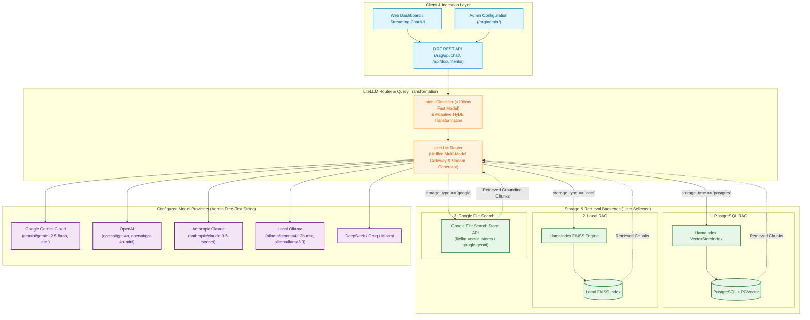
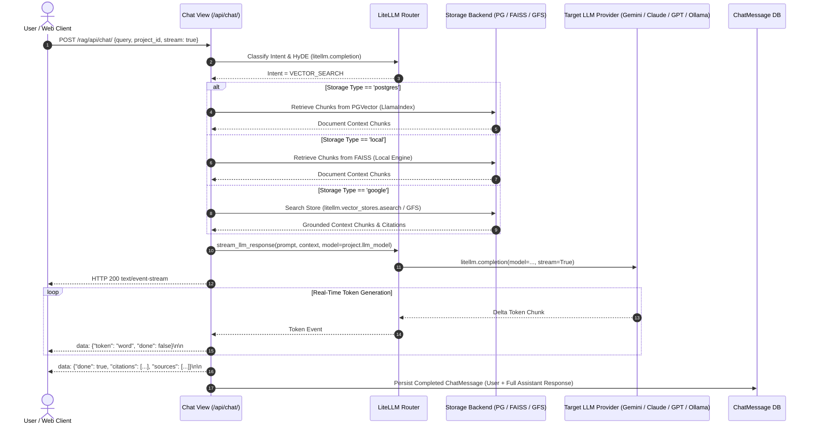

# Spec: Sprint Aug 5 - Unified Multi-Backend RAG with LiteLLM Router & SSE Streaming

**Sprint:** August 2026 (Aug 5)  
**Document Path:** `Design/Aug-26/Aug5/aug5-specs.md`  
**Status:** Aligned & Approved Specification  

---

## 1. Objective

To modernize and decouple the LLM layer across the entire RAG platform by introducing a unified **LiteLLM Router** in front of all projects and storage backends, along with real-time **Server-Sent Events (SSE) token streaming**.

### Key Goals:
1. **Universal LLM Gateway (LiteLLM Router):** Place LiteLLM in front of all project interactions (Chat, Ingestion, Intent Classification, Adaptive HyDE, and Evaluation). Admins can configure any model from Google Gemini, OpenAI, Anthropic Claude, DeepSeek, Groq, Mistral, or Local Ollama.
2. **Decoupled Multi-Backend Storage Support:** Retain complete flexibility across the 3 core storage backends:
   - **PostgreSQL RAG:** Database-backed vector indexing via PGVector and LlamaIndex.
   - **Local RAG:** Filesystem vector indexing via FAISS and LlamaIndex.
   - **Google File Search:** Managed cloud vector indexing via Gemini File Search Stores.
3. **Model-Agnostic Generation Across All Backends:** Enable any chosen model (e.g. Claude 3.5 Sonnet, GPT-4o, Local Gemma, Gemini 2.5 Flash) to synthesize answers regardless of which storage backend holds the document embeddings and chunks.
4. **Real-Time Token Streaming (SSE):** Support low-latency Server-Sent Events (`text/event-stream`) streaming token-by-token back to the client, while maintaining standard JSON response support when streaming is disabled.
5. **Resilience, Fallbacks & Telemetry:** Leverage LiteLLM's native retry mechanisms, global fallback provider lists (configured in `settings.py`), standardized JSON formatting, and token telemetry.

### Key Architectural & Design Decisions (Resolved via Alignment Interview):
1. **Model Configuration UI:** Free-text input field in Django Admin and Project forms allowing admins to enter any valid LiteLLM model identifier (e.g. `anthropic/claude-3-5-sonnet`, `gemini/gemini-2.5-flash-lite`, `openai/gpt-4o-mini`, `ollama/gemma4:12b-mlx`).
2. **API Key Management:** Global environment variables / `.env` file (e.g. `OPENAI_API_KEY`, `ANTHROPIC_API_KEY`, `GOOGLE_API_KEY`, `DEEPSEEK_API_KEY`), which LiteLLM automatically auto-detects.
3. **Streaming & Citations:** Stream tokens in real time as `data: {"token": "...", "done": false}\n\n`, followed by a final completion payload `data: {"done": true, "citations": [...], "sources": [...], "response_time": "..."}\n\n`.
4. **Intent & HyDE Model Routing:** Fast cloud model (e.g. `gemini/gemini-2.5-flash-lite` or `openai/gpt-4o-mini`) for Pre-Retrieval Intent Classification (<200ms latency), while Adaptive HyDE and answer synthesis use the project's configured `llm_model`.
5. **Evaluation Suite:** Evaluates with the project's configured model by default, with an optional Judge Model override in `EvaluationRun` parameters.

---

## 2. Architecture & System Design

LiteLLM acts as the single gateway for all LLM inference, embedding generation, query transformations, and synthesis across every project storage type.

### 2.1 High-Level Architecture Diagram



---

### 2.2 End-to-End Query Execution & SSE Streaming Sequence



---

## 3. Tech Stack

- **Backend Framework:** Django 4.x / Django REST Framework (DRF)
- **Universal LLM Layer:** `litellm` (v1.40+), `llama-index-llms-litellm`
- **RAG Orchestration:** `llama-index-core` (v0.10+), `llama-index-embeddings-google`, `llama-index-embeddings-ollama`
- **Streaming Protocol:** HTTP Server-Sent Events (`text/event-stream` via Django `StreamingHttpResponse`)
- **Storage & Vector Engines:**
  - PostgreSQL with `pgvector` (`psycopg2-binary`)
  - Local FAISS (`faiss-cpu`)
  - Google Gemini File Search Store (`google-genai` / `litellm.vector_stores`)
- **Supported Model Providers:** Google Gemini, OpenAI, Anthropic, Ollama, DeepSeek, Groq, Mistral
- **Testing:** `pytest`, `pytest-django`, `pytest-mock`

---

## 4. Commands

- **Install Dependencies:** `pip install -r requirements/base.txt`
- **Run Dev Server:** `python manage.py runserver`
- **Run All Unit Tests:** `DJANGO_ENV=testing pytest Testing/unit -v`
- **Run LiteLLM Router Unit Tests:** `DJANGO_ENV=testing pytest Testing/unit/chat/test_llm_router.py -v`
- **Run Streaming & Storage Integration Tests:** `DJANGO_ENV=testing pytest Testing/unit/chat/test_chat_rag_llm.py -v`
- **Run Regression Suite:** `DJANGO_ENV=testing pytest Testing/regression -v`

---

## 5. Project Structure Updates

```text
src/
  apps/
    projects/
      models.py         # Project model: llm_model free-text field for LiteLLM model identifiers
      admin.py          # Admin interface with free-text model input & API key instructions
    chat/
      llm_router.py     # Unified LiteLLM dispatch wrapper (generate_llm_response & stream_llm_response)
      services.py       # Adaptive HyDE using LiteLLM completion
      intent_service.py # Fast Intent classifier using LiteLLM structured JSON mode
      views.py          # Chat endpoint handling standard JSON and SSE StreamingHttpResponse
    evaluate/
      eval_services.py  # Synthetic QA generation and LLM-as-a-judge with optional Judge model override
    documents/
      services.py       # Vector store ingestion and retrieval helpers
  postgres_rag.py       # PostgreSQL / PGVector retrieval engine
  local_rag.py          # FAISS local vector retrieval engine
  google_file_search.py # Google File Search integration (native SDK & LiteLLM vector store)
static/
  js/
    chat.js             # Client-side SSE stream reader & Markdown parser
Testing/
  unit/
    chat/
      test_llm_router.py              # Tests for LiteLLM routing, streaming, fallbacks, and error parsing
      test_chat_rag_llm.py           # Multi-backend chat generation and SSE stream tests
      test_intent_classification.py  # Intent routing tests via LiteLLM
    evaluate/
      test_litellm_eval.py           # Evaluation pipeline tests using LiteLLM
```

---

## 6. Code Style & Implementation Patterns

- Use **f-strings** consistently for all string interpolations.
- Use **double quotes** (`"..."`) for strings.
- All LiteLLM calls must route through `src/apps/chat/llm_router.py` to ensure unified error mapping, logging, and timeouts.
- SSE chunks must follow the standard `data: <json>\n\n` event format.

### Code Style Example: LiteLLM Router with SSE Generator

```python
import json
import logging
from typing import Any, Dict, Generator, Optional
import litellm

logger = logging.getLogger(__name__)

litellm.drop_params = True
litellm.set_verbose = False


def generate_llm_response(
    prompt: str,
    model_id: str = "gemini/gemini-2.5-flash-lite",
    system_prompt: str = "",
    temperature: float = 0.2,
    max_tokens: int = 1024,
    disable_thinking: bool = False,
) -> str:
    """Synchronous completion via LiteLLM."""
    messages = []
    if system_prompt:
        messages.append({"role": "system", "content": system_prompt})
    messages.append({"role": "user", "content": prompt})

    kwargs: Dict[str, Any] = {
        "model": model_id,
        "messages": messages,
        "temperature": temperature,
        "max_tokens": max_tokens,
        "timeout": 60,
    }
    if disable_thinking and ("gemma" in model_id.lower() or "deepseek" in model_id.lower()):
        kwargs["extra_body"] = {"thinking": False}

    response = litellm.completion(**kwargs)
    return response.choices[0].message.content or ""


def stream_llm_response(
    prompt: str,
    model_id: str = "gemini/gemini-2.5-flash-lite",
    system_prompt: str = "",
    temperature: float = 0.2,
    max_tokens: int = 1024,
    disable_thinking: bool = False,
) -> Generator[str, None, None]:
    """
    Generator yielding SSE-formatted token chunks for streaming HTTP responses.
    """
    messages = []
    if system_prompt:
        messages.append({"role": "system", "content": system_prompt})
    messages.append({"role": "user", "content": prompt})

    kwargs: Dict[str, Any] = {
        "model": model_id,
        "messages": messages,
        "temperature": temperature,
        "max_tokens": max_tokens,
        "stream": True,
        "timeout": 60,
    }
    if disable_thinking and ("gemma" in model_id.lower() or "deepseek" in model_id.lower()):
        kwargs["extra_body"] = {"thinking": False}

    try:
        response_stream = litellm.completion(**kwargs)
        for chunk in response_stream:
            delta = chunk.choices[0].delta.content
            if delta:
                payload = json.dumps({"token": delta, "done": False})
                yield f"data: {payload}\n\n"
    except Exception as exc:
        logger.error(f"Streaming error on model '{model_id}': {exc}")
        err_payload = json.dumps({"error": str(exc), "done": True})
        yield f"data: {err_payload}\n\n"
```

---

## 7. Boundaries & Guardrails

- **Always:**
  - Route all LLM generation and streaming through `llm_router.py`.
  - Ensure `ChatMessage` records are saved in the database even when queries are streamed via SSE.
  - Return clear, actionable error events (`data: {"error": "...", "done": true}`) if local Ollama or cloud providers fail mid-stream.
  - Preserve tenant isolation and user permissions on every storage retrieval before streaming.
- **Ask First:**
  - Modifying existing database schema or removing existing storage backend tables.
  - Adding mandatory external SaaS credentials that break offline local testing.
- **Never:**
  - Hardcode vendor-specific SDK calls (`google.genai`, `openai`, `anthropic`) inside individual views; always use LiteLLM abstraction.
  - Drop or skip chat history persistence for streamed sessions.
  - Re-index or destroy existing document embeddings when an admin switches the generation `llm_model`.

---

## 8. Detailed Task Specifications

### TASK 1: Core LiteLLM Router (Synchronous & SSE Streaming)
- Refactor `src/apps/chat/llm_router.py` to support both `generate_llm_response` and `stream_llm_response`.
- Add normalized error handling for network errors, rate limits (HTTP 429), context length exceeded, and local Ollama connection drops.
- Support global fallback models defined in `settings.py`.

### TASK 2: Streaming Chat View & Multi-Backend Retrieval
- In `src/apps/chat/views.py`:
  - Check `request.data.get("stream", False)` or HTTP Accept header `text/event-stream`.
  - If streaming requested: Return a Django `StreamingHttpResponse(stream_generator(), content_type="text/event-stream")`.
  - If synchronous requested: Return standard `JsonResponse`.
  - Connect retrieved context from Postgres, Local FAISS, and Google File Search into the stream generator.
  - Accumulate the full streamed response and persist it to `ChatMessage`.

### TASK 3: Frontend SSE Stream Consumption
- In `static/js/chat.js` (or template inline scripts):
  - Read incoming SSE stream using `fetch()` + `ReadableStreamDefaultReader`.
  - Render tokens live in the message bubble with Markdown formatting as chunks arrive.
  - Display citations when the final completion event (`data: {"done": true, ...}`) is received.

### TASK 4: Intent Classification & HyDE Query Transformation with LiteLLM
- Refactor `src/apps/chat/intent_service.py` to use a fast cloud model (e.g. `gemini/gemini-2.5-flash-lite`) via `litellm.completion` with JSON mode (`response_format={"type": "json_object"}`).
- Refactor `src/apps/chat/services.py` (`generate_adaptive_hyde_passage`) to use LiteLLM with the project's configured model.

### TASK 5: Project Model Configuration & Admin Governance
- Update `Project.llm_model` in `src/apps/projects/models.py` to a free-text `CharField` allowing any LiteLLM string (e.g. `anthropic/claude-3-5-sonnet`, `gemini/gemini-2.5-flash`, `ollama/gemma4:12b-mlx`).
- Add project-level environment key validation in views/admin.

### TASK 6: Evaluation Suite Integration
- Update `src/apps/evaluate/eval_services.py` to use LiteLLM for synthetic QA generation and LLM-as-a-judge scoring metrics, supporting optional Judge Model overrides.

---

## 9. Success Criteria & Acceptance Tests

### Success Criteria:
- **Streaming & Non-Streaming Parity:** Chat endpoint works seamlessly in both SSE streaming (`stream=true`) and standard JSON (`stream=false`) modes.
- **Provider Agnostic:** Switching project models between Gemini, OpenAI, Claude, and Local Ollama works without changing query engine code or re-indexing stored vectors.
- **Unified Gateway:** 100% of LLM calls (Chat, HyDE, Intent, Eval) route through `src/apps/chat/llm_router.py`.
- **Zero Storage Leakage:** Context retrieved from Postgres, Local FAISS, or Google File Search respects strict tenant scoping.
- **Chat Persistence:** Full generated response is saved to `ChatMessage` at the end of every streamed response.

### Test Scenarios:
- [ ] **Scenario 1 (SSE Stream - Postgres + Claude):** Calling `/rag/api/chat/` with `stream=true` against a Postgres project streams tokens with `text/event-stream` and saves complete message to `ChatMessage`.
- [ ] **Scenario 2 (SSE Stream - Local Ollama):** Calling `/rag/api/chat/` with `stream=true` against an Ollama project streams tokens smoothly.
- [ ] **Scenario 3 (Sync JSON Mode):** Calling `/rag/api/chat/` without `stream=true` returns a standard `200 OK` JSON response with `{bot_response, source_documents, response_time}`.
- [ ] **Scenario 4 (Google File Search + Multi-Model):** Project with `storage_type='google'` retrieves citations from Google File Search and streams response using the selected model.
- [ ] **Scenario 5 (Intent Classification):** Greeting query (e.g. "Hi there") is classified with 0 vector searches executed.
- [ ] **Scenario 6 (Ollama Offline Graceful Failure):** When local Ollama is selected but offline, stream yields an error event or JSON error response with actionable message.
- [ ] **Scenario 7 (Model Switch Without Re-indexing):** Admin switches `llm_model` from `gemini/gemini-2.5-flash` to `openai/gpt-4o-mini` on a Postgres project; previous embeddings remain intact and queries execute immediately.
