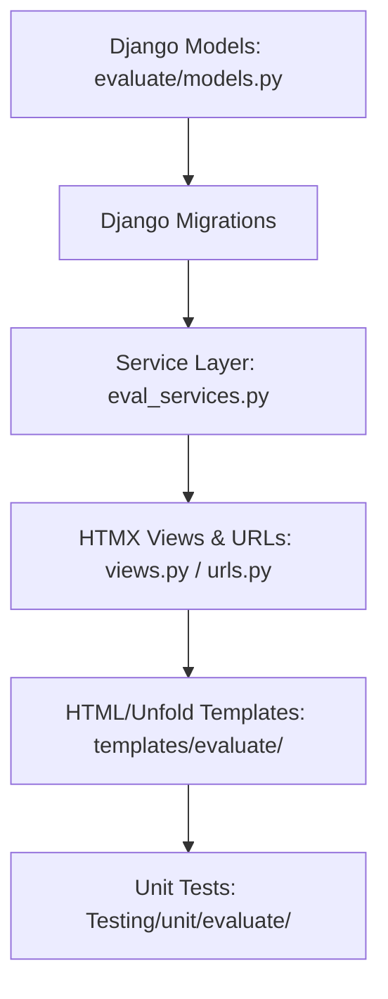

# Technical Implementation Plan: SyntheticQA Project-Level Evaluation

This plan outlines the vertical slices and architectural components for implementing the PostgreSQL RAG project-level evaluation suite inside the Django monolith application.

---

## 1. Architectural Overview & Dependency Graph

The implementation will be completely self-contained in the Django monolith (no FastAPI, no external Celery broker). It is structured to run heavy computations (QA synthesis and Ragas metric evaluations) inside asynchronous standard Python **background worker threads** to prevent HTTP request timeouts in Gunicorn.

### Component Dependency Flow:

---

## 2. Component Design & Vertical Slices

### Slice 1: Database Schema & Migrations
We will define the three models in `src/apps/evaluate/models.py` as specified in the finalized blueprint. Since the old models were unused/stubbed, we will replace them cleanly.

1. **`EvaluationDataset`**: Individual QA items (questions and ground truths). For user/CSV QAs, `document` is `None` (representing general project-level validation).
2. **`EvaluationRun`**: Execution tracker for an evaluation test suite.
3. **`EvaluationResultMetrics`**: Ragas scores for individual dataset items under a specific run.

**Verification Command**: `python manage.py makemigrations evaluate && python manage.py migrate`

---

### Slice 2: Service Layer (`eval_services.py`)
This layer handles interaction with `gemini-2.5-flash-lite` and the `ragas` library:

1. **`generate_synthetic_qas(project_id, num_questions)`**:
   - Fetches ingested text chunks for all documents in the project.
   - Partitions/distributes the target `num_questions` across the chunks.
   - Invokes `gemini-2.5-flash-lite` using LlamaIndex's `GoogleGenAI` wrapper with the structured JSON synthesis prompt.
   - Saves generated QA pairs to `EvaluationDataset` with `source='GENERATED'`.
2. **`execute_evaluation_run(run_id)`**:
   - Runs in a background thread (`threading.Thread`).
   - Fetches all `EvaluationDataset` records mapped to the project (both general and document-linked).
   - Simulates RAG: retrieves contexts from vector store and synthesizes answers via `gemini-2.5-flash-lite`.
   - Computes Ragas metrics (`context_recall`, `context_precision`, `faithfulness`, `answer_relevancy`) using the `ragas` library.
   - Saves metrics to `EvaluationResultMetrics` and marks `EvaluationRun` as `SUCCESS` (or `FAILED` with logged error details on exception).

**Verification Checkpoint**: Service helper unit tests with mocked LLM/Ragas calls to ensure robust data extraction.

---

### Slice 3: Dataset Acquisition UI (Manual Inputs & CSV Uploads)
1. **Dropdown control**: Standard HTMX dropdown to toggle between "Write own QAs" and "Generate QAs".
2. **Manual Form**: Dynamic input rows for writing Questions and Answers.
3. **CSV Uploader**: File upload handler validating case-insensitive `Question` and `Answer` headers, parsing rows, and saving them to `EvaluationDataset` with `source='CSV_UPLOAD'`.

---

### Slice 4: Automatic Synthesis UI & Background Threading
1. Expose numeric field `num_questions` under the "Generate QAs" toggle.
2. Form submission triggers a background thread (`threading.Thread(target=generate_synthetic_qas, args=(project_id, num_questions))`) and returns an HTMX progress/spinner view immediately.
3. Polling endpoint (`hx-trigger="every 3s"`) checks the generation status and displays the loaded QA list when finished.

---

### Slice 5: Evaluation Execution & Visual Dashboard
1. A clean Unfold-styled dashboard listing all RAG Projects.
2. Clicking "Run Evaluation" creates an `EvaluationRun` with `status="RUNNING"`, spins up the background evaluation thread, and starts polling.
3. Once completed, renders:
   - **Metrics Grid Table**: Aggregated average scores color-coded:
     - **Green (>= 0.85)**: High compliance.
     - **Yellow (0.70 - 0.84)**: Boundary warning.
     - **Red (< 0.70)**: Severe breakdown.
   - **Deep-Dive Drill Down**: Detail drawer/panel displaying individual question scores and their retrieved contexts to locate exact context crowding or hallucination patterns.

---

## 3. Verification Plan

### Automated Testing
- Pytest tests under `Testing/unit/evaluate/test_synthetic_qa_eval.py`.
- Mock LlamaIndex vector retriever, Gemini LLM calls, and Ragas metrics computation to avoid network requests and token costs during tests.
- Execution command: `DJANGO_ENV=testing .venv/bin/pytest Testing/unit/evaluate/ -v`

### Manual Verification
- Upload test CSV files with valid/invalid structures to ensure validation triggers.
- Run manual QA additions.
- Trigger QA generation and verify background thread success.
- Execute full RAG evaluation, monitoring status transitions (PENDING -> RUNNING -> SUCCESS) via HTMX polling.
