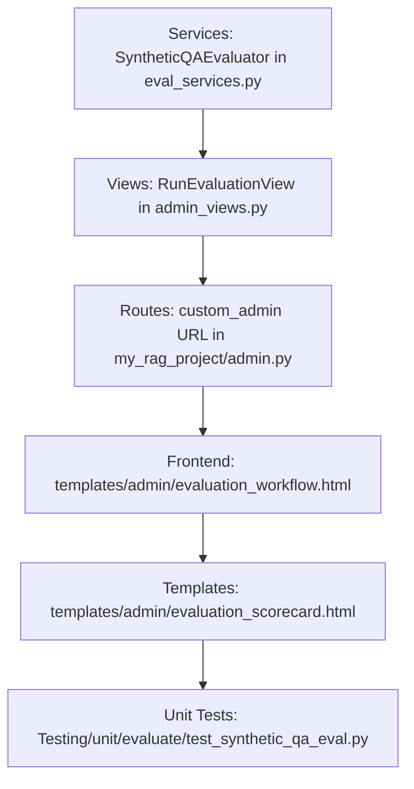

# Technical Implementation Plan: Switcher & Synthetic QA Restoration

This plan outlines the vertical slices and architectural components for restoring the "Synthetic QA Retrieval Validation" (originally Task 5 of June 2) and integrating it into the Ragas evaluation workflow dashboard via a method switcher dropdown.

---

## 1. Architectural Overview & Dependency Graph

The implementation restores the `SyntheticQAEvaluator` class in `eval_services.py` and maps a synchronous POST handler `RunEvaluationView` in `admin_views.py`. The frontend switcher dynamically reveals either the RAGAS or the Synthetic QA workspace.

### Component Dependency Flow:

---

## 2. Component Design & Vertical Slices

### Slice 1: Services (`eval_services.py`)
- Restore the `SyntheticQAEvaluator` class.
- Methods:
  - `fetch_document_nodes(document_name: str) -> list[dict]`: Connects to target postgres table using settings and returns up to 5 nodes. Use `psycopg2` for database operations.
  - `generate_synthetic_questions(node_text: str) -> list[str]`: Generates 3 questions using `gemini-2.5-flash-lite` via `genai.Client`.
  - `evaluate_retrieval_recall(document_name: str) -> dict`: Evaluates retrieval recall percentage by executing RAG similarity search and checking retrieved nodes.

**Verification Checkpoint**: Python shell or unit tests to verify evaluator can connect and fetch nodes successfully.

---

### Slice 2: Views & URLs
- Restore `RunEvaluationView(UnfoldModelAdminViewMixin, View)` class in `admin_views.py` which:
  - Processes `project_id`, `document_id`, and `eval_method`.
  - Performs synchronous `SyntheticQAEvaluator` execution.
  - Renders `admin/evaluation_scorecard.html`.
- Re-register path `evaluate/run/` to `RunEvaluationView` in `src/apps/my_rag_project/admin.py`.

**Verification Checkpoint**: Run server and make a POST request with curl/htmx to verify view response.

---

### Slice 3: Frontend Templates & Switcher
- Modify `templates/admin/evaluation_workflow.html`:
  - Remove `({{ p.dataset_items.count }} QA items)` from target project dropdown options text.
  - Add the "Evaluation Method" selector dropdown containing options `RAGAS` and `Synthetic QA`.
  - When **RAGAS** is selected:
    - Display the RAGAS dataset status info box.
    - Show "Configure QA Dataset" and "Run Benchmark Evaluation" buttons.
  - When **Synthetic QA** is selected:
    - Display a Target Document list selector container.
    - Fetch the project's documents dynamically using HTMX via `/rag/documents/<project_id>/?type=evaluate`.
    - Show the "Evaluate" button.
    - Post the form to `custom_admin:run-evaluation` using HTMX, targeting `#evaluation-content-pane`.

**Verification Checkpoint**: Verify the dropdown selection shows/hides correct panels and triggers HTMX document list load.

---

### Slice 4: Scorecard Template
- Create `templates/admin/evaluation_scorecard.html`:
  - Render panels for Retrieval Recall (%), Test Questions, and Citations Matched.
  - Render optimization insights box based on the recall score.
  - Render a table showing match status, question, expected node, and actual citations.

---

## 3. Verification Plan

### Automated Testing
- Add tests in `Testing/unit/evaluate/test_synthetic_qa_eval.py` to mock vector store retrieval, Gemini LLM call, and verify evaluation scoring.
- Execution command: `DJANGO_ENV=testing .venv/bin/pytest Testing/unit/evaluate/test_synthetic_qa_eval.py -v`

### Manual Verification
- Select project, select method "RAGAS", verify dataset details display.
- Select method "Synthetic QA", verify list of indexed documents is fetched.
- Select a document, click "Evaluate", verify spinner is shown and scorecard renders correctly.
