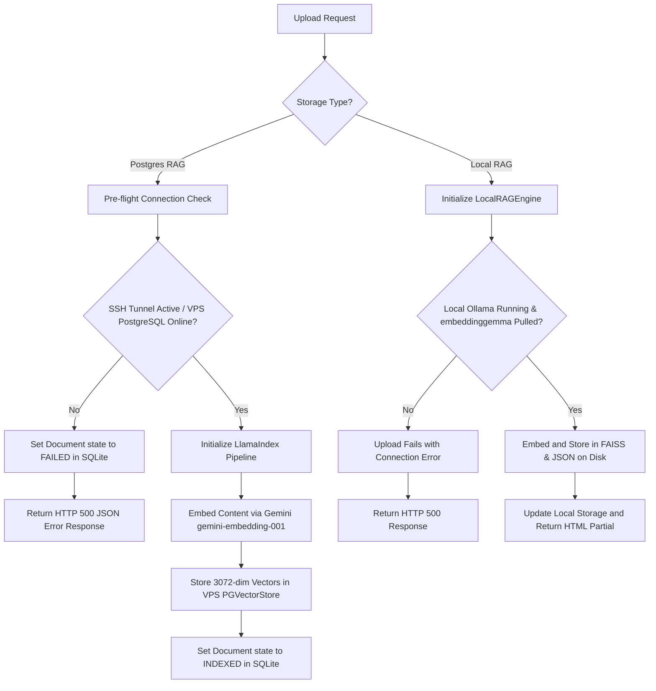

# Database & Vector Storage Architecture

This document describes how project metadata and document embeddings are stored across different environments (local development vs. production) and storage backends (**Postgres RAG** and **Local RAG**).

---

## 1. Project Metadata & Details Storage

All project details (metadata such as `project_id`, `display_name`, `storage_type`, `user_id`, and `created_at`) are managed using the **Django ORM** and stored in the default application database.

| Environment | Database | File/Instance Details |
| :--- | :--- | :--- |
| **Local Development** | SQLite | `db.sqlite3` in the project root directory |
| **Production** | PostgreSQL | Managed database defined via environment variables (`DB_NAME`, `DB_USER`, `DB_HOST`, `DB_PORT`) |

### Django Settings Module Configuration
Which database settings are loaded is determined dynamically by the `DJANGO_ENV` environment variable inside `src/apps/my_rag_project/settings/__init__.py`:

* **`development` (Default):** Extends `base.py` and inherits:
  ```python
  DATABASES = {
      'default': {
          'ENGINE': 'django.db.backends.sqlite3',
          'NAME': BASE_DIR / 'db.sqlite3',
      }
  }
  ```
* **`production`:** Overrides standard database settings using PostgreSQL:
  ```python
  DATABASES = {
      'default': {
          'ENGINE': 'django.db.backends.postgresql',
          'NAME': os.getenv('DB_NAME'),
          'USER': os.getenv('DB_USER'),
          'PASSWORD': os.getenv('DB_PASSWORD'),
          'HOST': os.getenv('DB_HOST'),
          'PORT': os.getenv('DB_PORT', '5432'),
      }
  }
  ```

---

## 2. Vector & Embeddings Storage

The location and engine used to store embeddings depend entirely on the project's **Storage Type**.

### Storage Type: Postgres RAG

The **Postgres RAG** storage type uses `LlamaIndexIngestionPipeline` (from `src/apps/documents/services.py`) to manage vector ingestion. Under the hood, LlamaIndex uses a **`PGVectorStore`** instance.

#### Local Development Behavior
When running the development server locally, project metadata continues to be saved in the local SQLite database (`db.sqlite3`). However, the document vector embeddings are stored directly in the **remote VPS PostgreSQL database**.

This is accomplished by:
1. **Settings Dictionary**: A dedicated settings configuration `REMOTE_POSTGRES_CONFIG` inside `src/apps/my_rag_project/settings/base.py` loads remote database credentials from the `#remote postgres` section of the `.env` file.
2. **SSH Tunneling**: An SSH tunnel is opened (e.g. automatically managed via the `./run.sh` wrapper script) that forwards local port `5432` to port `5432` on the VPS PostgreSQL instance at `127.0.0.1`.
3. **Pre-flight Connectivity Gating**: Both project creation and document uploads test the SSH tunnel connection first using `test_postgres_connection()` from `src/apps/projects/db_utils.py`. If the connection is offline, it blocks the operation with a clean error banner (via HTMX OOB swap) or sets the document state to `FAILED` in SQLite.
4. **Embedding Dimensions**: Vectors are embedded using the modern `GeminiEmbedding` (`models/gemini-embedding-001`) from `llama-index-embeddings-google` and stored in `PGVectorStore` with an embedding dimension of `3072`.

```python
vector_store = PGVectorStore.from_params(
    database=config.get("NAME", "postgres"),  # e.g., "rag_dashboard"
    host=config.get("HOST", "localhost"),     # e.g., "localhost" (via SSH Tunnel)
    port=config.get("PORT", "5432"),          # e.g., "5432"
    user=config.get("USER", "postgres"),      # e.g., "rag_user2"
    password=config.get("PASSWORD", ""),      # e.g., "ThinkRAG2026!"
    table_name=f"rag_project_{self.project_id}",
    embed_dim=3072                            # Aligned with gemini-embedding-001
)
```

> [!NOTE]
> **Active SSH Tunneling Required:** For local RAG operations to succeed, the SSH tunnel to the VPS must be active. Running `./run.sh` automatically establishes the tunnel, runs the development server, and tears down the tunnel cleanly upon stop.

#### Production Behavior
In the production environment, the Django application database itself is PostgreSQL (`DATABASES['default']` is populated with `DB_NAME`, `DB_USER`, etc.). The RAG pipelines connect directly to the same local or secure remote PostgreSQL instance without requiring an SSH tunnel, storing tables named `rag_project_<project_id>`.

---

### Storage Type: Local RAG

The **Local RAG** storage type utilizes the `LocalRAGEngine` (from `src/local_rag.py`). Instead of a SQL database, it persists embeddings to the local filesystem using:
1. **Ollama Embedding Model:** Generates embeddings locally using the `embeddinggemma` model at `http://localhost:11434`.
2. **FAISS (Facebook AI Similarity Search):** Stores vectors in memory and serializes them to `faiss_index.bin`.
3. **Metadata & Text Store:** Document content and metadata are serialized to a local JSON file (`metadata.json`).

All files are stored in the project's local directory path:
`rag_data/<project_id>/`

---

## 3. Document Ingestion / Upload Walkthrough (Local)

When a document upload request is made locally (`POST /rag/documents/<store_id>/upload/`):


