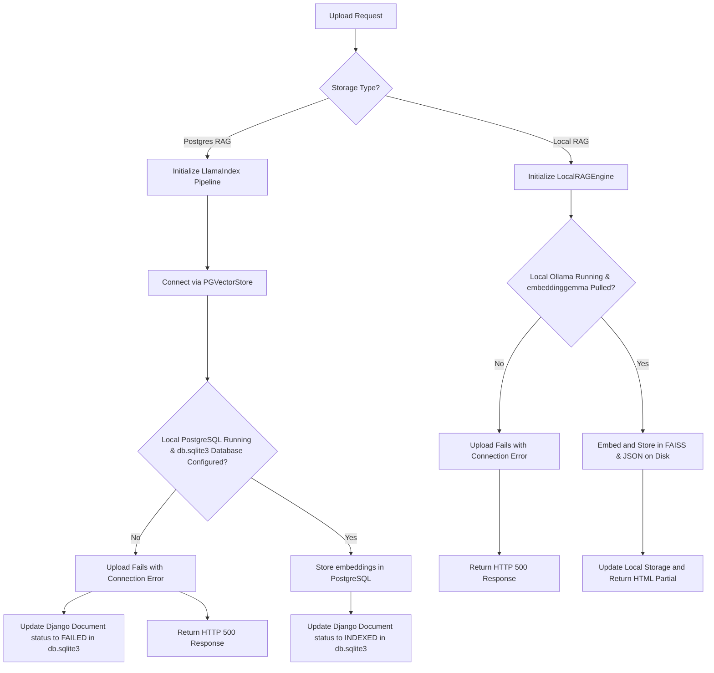

# Database & Vector Storage Architecture

This document describes how project metadata and document embeddings are stored across different environments (local development vs. production) and storage backends (**Postgres RAG** and **Local RAG**).

---

## 1. Project Metadata & Details Storage

All project details (metadata such as `project_id`, `display_name`, `storage_type`, `user_id`, and `created_at`) are managed using the **Django ORM** and stored in the default application database.

| Environment | Database | File/Instance Details |
| :--- | :--- | :--- |
| **Local Development** | SQLite | `db.sqlite3` in the project root directory |
| **Production** | PostgreSQL | Managed database defined via environment variables (`DB_NAME`, `DB_USER`, `DB_HOST`, `DB_PORT`) |

### Django Settings Module Configuration
Which database settings are loaded is determined dynamically by the `DJANGO_ENV` environment variable inside `src/apps/my_rag_project/settings/__init__.py`:

* **`development` (Default):** Extends `base.py` and inherits:
  ```python
  DATABASES = {
      'default': {
          'ENGINE': 'django.db.backends.sqlite3',
          'NAME': BASE_DIR / 'db.sqlite3',
      }
  }
  ```
* **`production`:** Overrides standard database settings using PostgreSQL:
  ```python
  DATABASES = {
      'default': {
          'ENGINE': 'django.db.backends.postgresql',
          'NAME': os.getenv('DB_NAME'),
          'USER': os.getenv('DB_USER'),
          'PASSWORD': os.getenv('DB_PASSWORD'),
          'HOST': os.getenv('DB_HOST'),
          'PORT': os.getenv('DB_PORT', '5432'),
      }
  }
  ```

---

## 2. Vector & Embeddings Storage

The location and engine used to store embeddings depend entirely on the project's **Storage Type**.

### Storage Type: Postgres RAG

The **Postgres RAG** storage type uses `LlamaIndexIngestionPipeline` (from `src/apps/documents/services.py`) to manage vector ingestion. Under the hood, LlamaIndex uses a **`PGVectorStore`** instance.

#### Local Development Behavior
When running the development server locally, the vector store configuration dynamically reads parameters from `settings.DATABASES['default']` (which is configured for SQLite) and uses fallback values for missing keys:

```python
vector_store = PGVectorStore.from_params(
    database=settings.DATABASES['default'].get('NAME', 'postgres'), # Resolves to SQLite path e.g. "db.sqlite3"
    host=settings.DATABASES['default'].get('HOST', 'localhost'),     # Falls back to "localhost"
    port=settings.DATABASES['default'].get('PORT', '5432'),          # Falls back to "5432"
    user=settings.DATABASES['default'].get('USER', 'postgres'),      # Falls back to "postgres"
    password=settings.DATABASES['default'].get('PASSWORD', ''),      # Falls back to ""
    table_name=f"rag_project_{self.project_id}",
    embed_dim=768
)
```

> [!WARNING]
> **Local Development Gotcha:** Because it dynamically retrieves the SQLite database filename (e.g., `db.sqlite3`) as the `database` name parameter, `PGVectorStore` will try to connect to a **PostgreSQL** server on `localhost:5432` with a database named `db.sqlite3` (or the absolute path). Unless that specific PostgreSQL database is running and configured locally, uploading documents under this storage type locally will fail with a database connection error.

#### Production Behavior
In the production environment, the `DATABASES['default']` dictionary is populated with the correct PostgreSQL configuration (`DB_NAME`, `DB_USER`, etc.). Therefore, `PGVectorStore` connects seamlessly to the actual production PostgreSQL instance and stores embeddings in the database table `rag_project_<project_id>`.

---

### Storage Type: Local RAG

The **Local RAG** storage type utilizes the `LocalRAGEngine` (from `src/local_rag.py`). Instead of a SQL database, it persists embeddings to the local filesystem using:
1. **Ollama Embedding Model:** Generates embeddings locally using the `embeddinggemma` model at `http://localhost:11434`.
2. **FAISS (Facebook AI Similarity Search):** Stores vectors in memory and serializes them to `faiss_index.bin`.
3. **Metadata & Text Store:** Document content and metadata are serialized to a local JSON file (`metadata.json`).

All files are stored in the project's local directory path:
`rag_data/<project_id>/`

---

## 3. Document Ingestion / Upload Walkthrough (Local)

When a document upload request is made locally (`POST /rag/upload/<store_id>/`):


