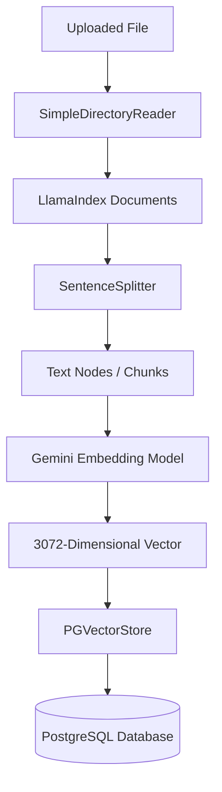
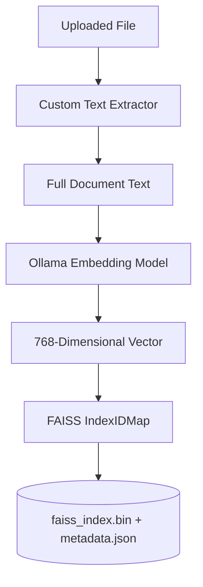

# Document Indexing Pipeline Architecture

This document provides a detailed technical overview of how documents are parsed, text is chunked/split, embeddings are generated, and vectors are persisted across the different RAG storage backends in the system.

The platform provides two distinct ingestion pipelines tailored to their respective environments:
1. **PostgreSQL RAG Pipeline** (LlamaIndex + Google Gemini Embeddings)
2. **Local RAG Pipeline** (Ollama + FAISS Indexing)

---

## 📊 Summary Comparison

| Ingestion Phase | PostgreSQL RAG Pipeline (`postgres`) | Local RAG Pipeline (`local`) |
| :--- | :--- | :--- |
| **Parsing Engine** | LlamaIndex `SimpleDirectoryReader` | Custom Python extractor + `pypdf` |
| **Text Chunking** | `SentenceSplitter` (1024-token chunks, 20-token overlap) | Whole-document ingestion (No split) |
| **Embedding Model** | Google Gemini `models/gemini-embedding-001` | Ollama `embeddinggemma` |
| **Vector Dimension** | **3072** | **768** |
| **Vector Store** | PostgreSQL (`pgvector`) | FAISS FlatL2 Index (`faiss_index.bin`) |
| **Metadata DB** | PostgreSQL project tables | `metadata.json` |

---

## 🐘 1. PostgreSQL RAG Pipeline (LlamaIndex & Gemini)

The PostgreSQL pipeline is configured in `src/apps/documents/services.py` inside the class `LlamaIndexIngestionPipeline`. It handles RAG data ingestion for projects prefixed with `postgres_` or `rag_`.

### Phase A: Document Ingestion & Parsing
* **Class Used:** `SimpleDirectoryReader(input_files=[file_path])`
* **Mechanism:**
  * Auto-detects file type extensions (`.pdf`, `.txt`, `.md`).
  * Utilizes specialized parsers under the hood (e.g., `PyMuPDFReader` or `pypdf` for PDFs, plain string readers for text/markdown).
  * Returns an array of standard LlamaIndex `Document` structures, complete with extracted text and file metadata (path, filename, creation times).

### Phase B: Text Chunking & Splitting
* **Class Used:** `SentenceSplitter` (automatically invoked during `VectorStoreIndex.from_documents` processing).
* **Mechanism:**
  * Converts parent `Document` objects into fine-grained `TextNode` objects representing smaller chunks.
  * Uses a token-based strategy (defaulting to **1024 tokens** per chunk with a **20-token overlap** between successive chunks).
  * Smart boundaries: Splitting is performed while respecting paragraph, sentence, and word boundary markers to ensure that sentence structure is not severed in a way that hurts semantic retrieval.

### Phase C: Embedding Generation
* **Class Used:** `GeminiEmbedding` (configured via `llama_index.embeddings.google`).
* **Model Name:** `models/gemini-embedding-001`
* **Mechanism:**
  * Uses your local/vps `GOOGLE_API_KEY` to authenticate remote API calls to Google's Generative Language API.
  * Generates high-fidelity **3072-dimensional vector embeddings** for each individual `TextNode`.
  * Embeddings represent the exact semantic and contextual fingerprint of that chunk.

### Phase D: Persistence (`PGVectorStore`)
* **Class Used:** `PGVectorStore.from_params()`
* **Mechanism:**
  * Establishes a connection using credentials defined in `settings.REMOTE_POSTGRES_CONFIG`.
  * Dynamically creates a PostgreSQL table named `f"rag_project_{project_id}"` with the `pgvector` extension enabled.
  * Maps each node's chunk ID, content text, metadata dictionaries, and the 3072-dimension vector embedding directly into the table.

---

## 💻 2. Local RAG Pipeline (Ollama & FAISS)

The Local pipeline is managed by `LocalRAGEngine` in `src/local_rag.py`. It is tailored for edge deployments, running fully offline using a local Ollama service and FAISS.

### Phase A: Document Ingestion & Parsing
* **Methods Used:** `extract_text_from_file(file_path)`
* **Mechanism:**
  * For `.pdf`: Invokes `pypdf.PdfReader` to extract text page-by-page.
  * For `.txt` & `.md`: Standard Python file reader `open(..., encoding='utf-8')`.
  * Returns the full, contiguous string representation of the document.

### Phase B: Text Chunking & Splitting
* **Mechanism:**
  * **No intermediate chunking is performed.**
  * The entire extracted document string is kept intact as one single parent chunk.
  * The vector representation is calculated across the entire text payload at once.

### Phase C: Embedding Generation
* **Class Used:** `OllamaEmbedding` (configured via `llama_index.embeddings.ollama`).
* **Model Name:** `embeddinggemma` (hosted locally at `http://localhost:11434`).
* **Mechanism:**
  * Queries the local Ollama instance's embedding endpoint.
  * Yields a **768-dimensional vector embedding** mapping the semantic profile of the entire file.

### Phase D: Persistence (`FAISS`)
* **Class Used:** `faiss.IndexIDMap` wrapping `faiss.IndexFlatL2`.
* **Mechanism:**
  * Maintains an in-memory document-to-index mapping using flat L2 distance calculations.
  * Saves the FAISS index to the local file system at `rag_data/<project_id>/faiss_index.bin`.
  * Saves corresponding full texts and timestamps in a companion JSON file at `rag_data/<project_id>/metadata.json`.
