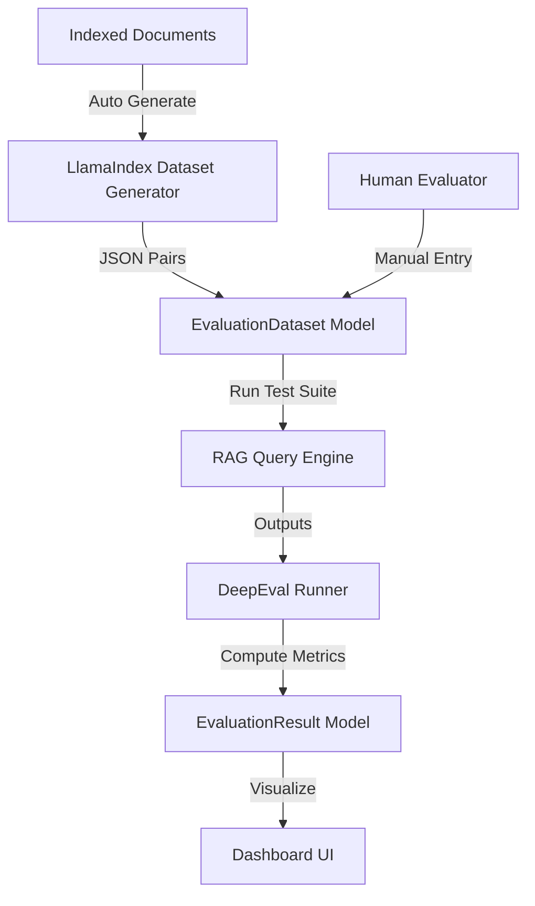

# Evaluation Subsystem Architecture & Status

This document provides a comprehensive technical blueprint of the **RAG Evaluation Subsystem**, analyzing the current database models, API structures, frontend templates, and detailing a roadmap of completed features vs. pending integrations.

---

## 📐 1. Architectural Overview

The Evaluation subsystem is designed to measure the performance, precision, and safety of RAG queries using three core methodologies:

1. **Auto Generate (`auto`):** Automated synthetic dataset creation. Generates high-quality question-answer pairs directly from the text of indexed documents.
2. **Manual (`manual`):** User-defined test suites. Enables human evaluators to create custom QA pairs representing real-world questions and expected ground-truth answers.
3. **DeepEval (`deepeval`):** Automated LLM-assisted metrics evaluation. Evaluates system answers against the dataset using advanced criteria (e.g., *Faithfulness*, *Answer Relevance*, *Hallucination*, and *Contextual Precision*).



---

## ✅ 2. What Has Been Done

### A. Database Models (`src/apps/evaluate/models.py`)
Two core Django database models have been fully implemented to track evaluation runs and datasets:

* **`EvaluationDataset`:** 
  * Tracks generated datasets linked to specific RAG projects.
  * Handles lifecycle states: `PENDING`, `GENERATING`, `GENERATED`, and `FAILED`.
  * Stores generated pairs in a standard `JSONField` called `qa_pairs` containing dictionaries of `{"query": "...", "reference_answer": "..."}`.
  * Tracks configuration variables (e.g., `num_questions`, generator models, and parameters).
* **`EvaluationResult`:**
  * Stores metrics from evaluation runs against a dataset.
  * Uses a structured `JSONField` named `metrics` to save multi-dimensional scores (e.g., faithfulness, hallucination).
  * Uses an `individual_scores` `JSONField` to record detailed per-question answers, sources, and scores for debugging.

### B. REST API Layer (`src/apps/evaluate/api_views.py`)
Standard REST capabilities have been built using Django Rest Framework (DRF) to support programmatic client access:
* **`EvaluationDatasetViewSet`** (mapped via `/rag/api/datasets/`):
  * Standard CRUD endpoints for datasets.
  * Custom actions: `by_project` (filter by project) and `results` (fetch all evaluation runs for a dataset).
* **`EvaluationResultViewSet`** (mapped via `/rag/api/results/`):
  * Read-only viewset listing evaluation scores.
  * Custom action: `by_project` and `by_dataset` for analytics filtering.

### C. Frontend Dashboard (`templates/evaluate/evaluate.html`)
An interactive sidebar and result-panel UI has been designed:
* **Layout Structure:** A split-screen layout with an adjustable, resizable divider.
* **Selection Sidebars:** Dropdowns and lists to filter and select the target Project and File.
* **Control Actions:** A dropdown to select the evaluation method (`auto`, `manual`, `deepeval`) and an interactive `Generate` trigger button.

---

## ⚠️ 3. Structural Bugs & Mismatches Identified

During the analysis of the current code, two significant frontend-to-backend interface mismatches were identified:

### 1. File Listing Format Mismatch (`evaluate.html:L119`)
* **The Bug:** The JavaScript function `loadEvaluateFiles` fetches data using:
  ```javascript
  fetch('{{ url_prefix }}/api/projects/' + encodeURIComponent(storeId) + '/documents?type=evaluate')
  ```
  This endpoint returns a **JSON array** produced by `ProjectViewSet.documents`. However, the JavaScript code immediately treats the response as **raw HTML** and attempts to set `fileListDiv.innerHTML = html;`, leading to broken rendering.
* **The Fix:** The fetch URL should target the dedicated HTML partial listing view:
  ```javascript
  fetch('{{ url_prefix }}/documents/' + encodeURIComponent(storeId) + '/?type=evaluate')
  ```

### 2. Main Generation Route Unmapped
* **The Bug:** Clicking the `Generate` button sends a `POST` request to `{{ url_prefix }}/api/evaluate`. This route does not exist in the Django URLs file (`src/apps/evaluate/urls.py` is currently empty), causing all frontend generation requests to fail with a `404 Not Found`.

---

## 🛠️ 4. What Is Pending (Roadmap)

To make the evaluation subsystem fully functional, the following components are currently pending implementation:

### Task A: Implement & Register the Generation API Route
* Re-enable the `/rag/api/evaluate` URL routing inside Django.
* Create a Django view to handle POST requests, validate parameters (`store_id`, `doc_id`, `method`), create an `EvaluationDataset` in `PENDING` state, and trigger background worker tasks to process the dataset.

### Task B: Auto Generate Pipeline (LlamaIndex Integration)
* **Goal:** Automate synthetic question-answer generation.
* **LlamaIndex Integration:**
  * Utilize LlamaIndex's `RagDatasetGenerator` or `SimpleDatasetGenerator`.
  * Parse documents into text chunks, feed them to a generator model (e.g., `gemini-2.5-flash`), and compile standard `qa_pairs` (containing high-quality queries and reference answers).
  * Save the compiled pairs to the `EvaluationDataset` object and transition its status to `GENERATED`.

### Task C: Manual Evaluation Pipeline & UI
* **Goal:** Enable user-curated test suites.
* **Implementation:**
  * Build a simple UI modal in `evaluate.html` allowing users to click "Add QA Pair" and manually input their own queries and reference answers.
  * Send these inputs as a JSON payload to `POST /rag/api/datasets/` to save custom user datasets directly.

### Task D: DeepEval Metrics Pipeline Integration
* **Goal:** Integrate structured LLM evaluations.
* **Implementation:**
  * Set up the python `deepeval` framework inside the backend.
  * Create an evaluation runner that loops over the selected dataset:
    1. Query the RAG engine using the dataset's `query`.
    2. Capture the `response` and the retrieved `source_nodes` (context blocks).
    3. Run DeepEval's metric calculations:
       * **Faithfulness:** Verifies the answer is strictly based on context blocks (no hallucination).
       * **Answer Relevancy:** Measures how directly the answer addresses the original query.
       * **Contextual Recall:** Assesses if the retriever pulled all necessary context blocks to formulate the answer.
    4. Compile the individual scores and write the summarized metrics back to an `EvaluationResult` record in the database.
