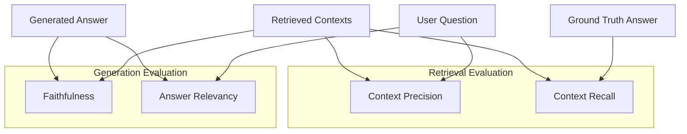

# RAG Evaluation with Ragas

This document explains the benchmark evaluation metrics used to assess the performance of the Retrieval-Augmented Generation (RAG) system. These metrics are evaluated using the Ragas (Retrieval Augmented Generation Assessment) framework or fallback LLM-based evaluators.

---

## Core Metrics Overview

A standard RAG pipeline is evaluated across two main components: **Retrieval** (fetching the correct contexts) and **Generation** (synthesizing the answer). Ragas divides the evaluation into four primary metrics:

---

## Total RAG Triad Score

To give a single high-level measure of the entire RAG system's health, we compute a **Total RAG Triad Score** (or **Total Score**). This aggregates both the retrieval and generation components of the system.

### Suggested Formula
The Total Score is calculated as the simple arithmetic mean of the four core metrics:

$$\text{Total Score} = \frac{\text{Faithfulness} + \text{Answer Relevancy} + \text{Context Recall} + \text{Context Precision}}{4}$$

This puts equal weight on:
1. **Factual Grounding** (Faithfulness)
2. **Direct Alignment** (Answer Relevancy)
3. **Retrieval Completeness** (Context Recall)
4. **Retrieval Relevance** (Context Precision)

### Target Scores
* **$\ge 0.85$ (Optimal Performance)**: The pipeline retrieves correct and dense contexts and synthesizes highly factual, direct answers.
* **$0.70 - 0.84$ (Needs Optimization)**: Boundary state. One or more components (e.g. retrieval precision or generation fluff) require adjustment.
* **$< 0.70$ (Critical Failure)**: Severe system issue, such as heavy hallucinations or complete retrieval failure.

---

## 1. Faithfulness

> [!NOTE]
> *Also referred to as factual consistency or "failtfulness" (typographical variation).*

### Definition
**Faithfulness** measures the factual consistency of the generated answer against the retrieved contexts. It checks whether the generated answer is fully grounded in and derived **only** from the retrieved documents, ensuring the model does not hallucinate or extrapolate external information.

### How it is Calculated
1. The evaluator LLM identifies all distinct factual statements/claims in the generated answer.
2. For each statement, the evaluator checks if it can be directly inferred from the retrieved contexts.
3. The score is computed as:
   $$\text{Faithfulness} = \frac{\text{Number of factual statements supported by retrieved contexts}}{\text{Total number of factual statements in generated answer}}$$

### Why it Matters
High faithfulness indicates a low hallucination rate. If this score is low, the LLM is adding information not present in your files, which is critical to fix in corporate or domain-specific environments.

---

## 2. Answer Relevancy

### Definition
**Answer Relevancy** measures how well the generated answer directly addresses the user's initial question. It penalizes answers that are incomplete, vague, redundant, or contain excessive irrelevant fluff, even if they are factually correct.

### How it is Calculated
1. The evaluator LLM is given the generated answer and asked to reconstruct/generate $N$ potential questions that this answer could satisfy.
2. The semantic similarity (via embedding cosine similarity) is calculated between these newly generated questions and the user's original question.
3. The score is computed as the average cosine similarity:
   $$\text{Answer Relevancy} = \frac{1}{N} \sum_{i=1}^{N} \text{sim}(\text{Question}_{\text{original}}, \text{Question}_{\text{generated}, i})$$

### Why it Matters
A high answer relevancy score means the system is direct and helpful. If the score is low, the system might be generating generic text, failing to answer the user's prompt directly, or including unrelated information.

---

## 3. Context Recall

### Definition
**Context Recall** measures the retriever's ability to fetch all the necessary information required to answer the question. It assesses the completeness of the retrieved contexts by comparing them against the target **Ground Truth** (the ideal human-provided answer).

### How it is Calculated
1. The evaluator LLM breaks down the ground truth answer into individual statements.
2. Each statement is analyzed to determine if it can be found in or attributed to the retrieved contexts.
3. The score is computed as:
   $$\text{Context Recall} = \frac{\text{Number of ground truth statements found in retrieved contexts}}{\text{Total number of statements in ground truth answer}}$$

### Why it Matters
Context recall is the primary metric for the retriever's coverage. A low context recall score means the vector search/retrieval pipeline is failing to fetch the correct chunks of text, making it impossible for the LLM to write a complete answer.

---

## 4. Context Precision

### Definition
**Context Precision** evaluates the signal-to-noise ratio of the retrieved contexts and assesses the quality of their ranking. It measures whether the most relevant information is placed at the top of the retrieved chunks.

### How it is Calculated
1. For each retrieved chunk, the evaluator LLM determines if it is relevant to answering the question.
2. Precision at rank $k$ is calculated for each position.
3. The score is calculated as the Mean Average Precision (MAP) of the retrieval results:
   $$\text{Context Precision} = \frac{\sum_{k=1}^{K} (P@k \times v_k)}{\text{Total number of relevant chunks in top } K}$$
   Where $v_k$ is 1 if chunk $k$ is relevant, and 0 otherwise.

### Why it Matters
Even if your system retrieves the correct information (high recall), putting irrelevant chunks at the top (low precision) distracts the LLM, consumes context window tokens, and increases synthesis costs. High context precision ensures high-density, well-ranked context.

---

## Summary Matrix

| Metric | Inputs Required | Evaluates | Target Score | Typical Solutions for Low Scores |
| :--- | :--- | :--- | :--- | :--- |
| **Faithfulness** | Contexts, Answer | LLM Generation (Hallucinations) | $\ge 0.85$ | System prompt engineering, adjusting temperature to $0.0$, using stronger LLMs. |
| **Answer Relevancy** | Question, Answer | LLM Generation (Directness) | $\ge 0.85$ | Improving the system prompt instructions, adding user constraints. |
| **Context Recall** | Contexts, Ground Truth | Retrieval (Coverage) | $\ge 0.85$ | Adjusting chunk size/overlap, changing embedding models, increasing `top_k`. |
| **Context Precision** | Question, Contexts | Retrieval (Ranking & Density) | $\ge 0.85$ | Implementing a reranker (e.g. Cohere, BGE), refining chunk chunking strategy. |

---

## Codebase Implementation

In this project, evaluations are initiated asynchronously in [eval_services.py](file:///Users/chrys/Projects/my_rag/src/apps/evaluate/eval_services.py). 

The pipeline supports two execution paths:
1. **Ragas Integration**: If the `ragas` library is installed, it packages the traces into a Hugging Face Dataset format and runs `ragas.evaluate` to compute these exact metrics.
2. **Fallback LLM Evaluation**: If `ragas` is unavailable, [_evaluate_metric_via_llm](file:///Users/chrys/Projects/my_rag/src/apps/evaluate/eval_services.py#L503-L554) runs structured evaluation prompts directly on Gemini to estimate the scores.
